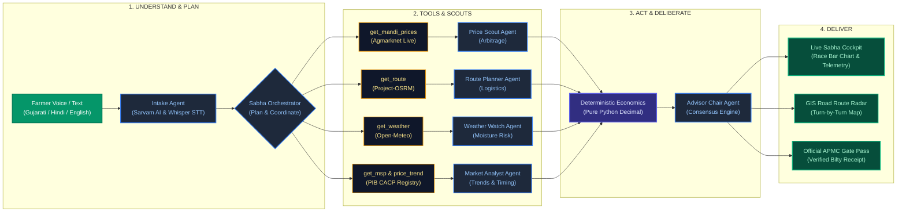

# 🌾 MandiSabha
### *Autonomous Multi-Agent Agricultural Market Intelligence & Real-Time Net Realization Engine*

---

<p align="center">
  
  
  
  <a href="https://docs.google.com/presentation/d/1JL9U1y64Fx31BtwbEReYRGZu4cAh6K-b/edit?usp=sharing&ouid=102954601433148212637&rtpof=true&sd=true" target="_blank">
    
  </a>
</p>

<p align="center">
  <!-- Frontend Badges -->
  
  
  
  
  
  
  <!-- Backend Badges -->
  
  
  
  
  
  <!-- AI & Intelligence Badges -->
  
  
  
  
  
</p>

---

## 👥 Hackathon Team & Submission Details

* **Hackathon:** **BHARAT AGENTIC 2026** *(Organized by AIKart)*
* **Date:** 1 October 2026
* **Team Name:** **Aura Spectre**
* **Team Members:**
  * 👑 **Yash Bharvada** — *Team Lead, Architecture, Multi-Agent Engineering & Full-Stack Systems*
  * 🌟 **Pankti Akbari** — *Co-Lead, Indic Speech Pipelines, Frontend UX & Data Integration*
* **Challenge Domains:** **AgriTech & Rural** / **Bharat Languages & Accessibility**
* **Project Name:** **MandiSabha (VyaaparMitra)**
* **Mission:** *Build the Agents. Build Bharat.*
* **📊 Project Presentation (PPT):** [**View / Download Google Slides Presentation**](https://docs.google.com/presentation/d/1JL9U1y64Fx31BtwbEReYRGZu4cAh6K-b/edit?usp=sharing&ouid=102954601433148212637&rtpof=true&sd=true)

---

## 🎯 The Real-World Problem in Bharat

Over **86% of Indian farmers are small and marginal**, cultivating landholdings under 2 hectares. During harvest, farmers face four systemic market barriers:

1. **The Deception of "Gross Mandi Price":**
   Traditional government dashboards (Agmarknet) and price apps show raw modal rates per quintal. A mandi 90 km away offering ₹2,600/q sounds much better than a local yard offering ₹2,350/q. However, when factoring in **mini-truck freight (1.5T LCV), empty return-leg diesel costs, highway toll plazas, and commission deductions**, the distant mandi frequently produces a **net loss**.
2. **Trader Cartels & Information Asymmetry:**
   Middlemen (*arthiyas*) capitalize on the farmer's lack of transparent, real-time arrival data and price trends across neighboring APMC market yards.
3. **Perishability & Transit Weather Risk:**
   Unseasonal rain or high humidity along transport corridors can destroy 10%–25% of perishable crop value (onions, tomatoes, garlic) during transit.
4. **Digital & Language Friction:**
   Rural farmers communicate in native dialects and code-mixed vernacular terms (*"Gondal ma bhav shu che?", "Katta", "Quintal", "Bhav batao"*). Typing into complex English dashboards or tabular websites is unusable for them.
5. **Chatbot Hallucinations:**
   Standard conversational LLMs hallucinate prices, miscalculate road mileage, and fail to provide legally valid, operational paperwork.

---

## 💡 The Solution: MandiSabha (VyaaparMitra)

**MandiSabha** replaces passive search engines and generic chatbots with an **Autonomous Multi-Agent Deliberation Council** (modeled after an Indian village *Gram Sabha*). 

Instead of a single AI guessing answers, **five specialized AI agents** collaborate, execute deterministic mathematical tools, debate trade-offs, and reach a consensus to compute **Guaranteed Net Pocket Realization** for the farmer.

### What Makes MandiSabha Truly "Agentic":
* 🚫 **Not a Chatbot:** It does not simply generate generic chat prose. It autonomously perceives, plans, calls real-world APIs, computes highway telemetry, runs multi-agent challenges, and outputs actionable APMC paperwork.
* 🛡️ **Zero-Hallucination Money Engine:** Pure Python `Decimal` economics engine. The Advisor Chair agent is forbidden from inventing prices or distances; all figures must originate from verified tool execution records.
* 🎙️ **Indic Vernacular Intelligence:** Native voice recognition in **Gujarati (ગુજરાતી), Hindi (हिन्दी), Marathi (मराठी), and Indian English**, handling colloquial dialect expressions and automatic metric conversions (kg, quintal, metric ton).
* 📄 **Institutional Actionability:** Automatically generates a photorealistic, single-page print-ready **APMC Mandi Loading Pass and Transit Bilty** with QR verification, designated weighbridge lanes, and guaranteed net earnings.

---

## 🧠 Core Agent Flow

MandiSabha strictly enforces the BHARAT AGENTIC 2026 Core Workflow:

$$\mathbf{Understand} \longrightarrow \mathbf{Reason} \longrightarrow \mathbf{Plan} \longrightarrow \mathbf{Use\ Tools} \longrightarrow \mathbf{Act} \longrightarrow \mathbf{Deliver}$$



---

## 🏛️ System Architecture

MandiSabha is built as a high-performance, decoupled micro-architecture combining asynchronous Python backend processing with a responsive Next.js frontend:


---

## 🤖 The 5-Agent Council Breakdown

| Agent | Codename | Role | Allowed Tools | Responsibilities & Guardrails |
|---|---|---|---|---|
| **1. Intake Agent** | `intake` | Voice & Text Entity Parser | `geocode` | Parses spoken Hindi/Gujarati/English audio transcripts into normalized JSON. Converts units (kg/ton/katta → quintals), resolves relative harvest dates (*aaj, kal, parso*), and geocodes farm coordinates. |
| **2. Price Scout** | `mandi` | Mandi Arbitrage Scout | `get_mandi_prices`, `compute_net_value` | Connects to Agmarknet live feeds across candidate mandis within the radius. Deduplicates dates, verifies daily arrivals volume, and extracts verified modal, min, and max rates. |
| **3. Route Planner** | `logistics` | Logistics & Fuel Specialist | `get_route`, `compute_net_value` | Calculates exact highway driving distance (km) and duration via OSRM. Computes vehicle capacity threshold trips (1.5T pickup vs 6T truck vs 15T heavy truck) and applies empty return leg factor (2.0×). |
| **4. Weather Watch** | `risk` | Moisture & Transit Risk Watch | `get_weather` | Evaluates hourly precipitation, humidity, and cloud radar along the transit corridor between the farm and target APMC yards. Calculates heuristic perishability risk. |
| **5. Market Analyst** | `analyst` | Trends & Timing Analyst | `get_price_trend`, `get_msp`, `get_mandi_prices` | Benchmarks live modal prices against Government Minimum Support Price (MSP). Determines 7-day momentum and advises whether to *"Sell Now"*, *"Hold/Wait"*, or *"Split Consignment"*. |
| **Chair: Advisor Chair** | `negotiator` | Consensus & Arbitration Engine | *None (Strict Data Consumer)* | **Zero-Hallucination Guardrail:** Reads structured findings from all 4 scouts. Cannot query external web tools. Delivers audited ranking strictly based on highest net realization. |

---

## 🧮 Mathematical Economics Engine: The True Net Formula

Unlike consumer price apps that simply compare $P_{\text{modal}}$, MandiSabha executes pure `Decimal` arithmetic:

$$\text{Gross Produce Value} = Q \times P_{\text{modal}} \times \mu_{\text{grade}}$$

$$\text{Vehicle Trips} = \left\lceil \frac{Q}{\text{Capacity}_{\text{vehicle}}} \right\rceil$$

$$\text{Freight Total} = \text{Trips} \times \text{Distance}_{\text{km}} \times \text{Rate}_{\text{vehicle}} \times f_{\text{return-leg}}$$

$$\text{Net Payoff} = \text{Gross Produce Value} - \text{Freight Total} - \text{Tolls} - \text{Loading Charges} - (\text{Gross} \times \text{Spoilage Rate})$$

$$\text{Net Surplus vs Local} = \text{Net Payoff}_{\text{candidate}} - \text{Net Payoff}_{\text{local-baseline}}$$

**Where:**
* $Q$: Quantity in Quintals
* $P_{\text{modal}}$: Mandi Modal Price per Quintal
* $\mu_{\text{grade}}$: Crop Grade Multiplier ($A = 1.05,\ B = 1.00,\ C = 0.92$)
* $f_{\text{return-leg}}$: Empty return-leg factor ($2.0\times$ default)
* $\text{Capacity}$: Pickup ($15\text{ q}$), Truck ($60\text{ q}$), Heavy ($150\text{ q}$)
* $\text{Rate}$: Pickup ($₹14\text{/km}$), Truck ($₹28\text{/km}$), Heavy ($₹40\text{/km}$)

---

## 📁 Detailed Workspace & Folder Structure

```text
d:\VyaaparMitra/
│
├── README.md                                # Official Hackathon Master Documentation
├── mandisabha_readme.md                     # Hackathon Submission Mirror
├── RESPONSIVE_AUDIT.md                      # Complete Mobile-Responsive Audit & Viewport Specs
├── Modern Product Feature...pptx            # Pitch Deck Presentation File
├── Green_wheat_crop_camera_pullback...mp4   # Cinematic Background Media
│
├── frontend/                                # Next.js 16 Client & Presentation Tier
│   ├── app/                                 # App Router Pages & API Routes
│   │   ├── layout.tsx                       # Global HTML Root, Viewport, Theme & Fonts
│   │   ├── page.tsx                         # Landing Page Gateway
│   │   ├── globals.css                      # Tailwind v4 Tokens, Dark/Light Themes, Print CSS
│   │   ├── dashboard/page.tsx               # Farmer Dashboard, 4-Stat Cards & Revenue Ledger
│   │   ├── explore/page.tsx                 # Nationwide Mandi Explorer & Head-to-Head Comparator
│   │   ├── history/page.tsx                 # Historical Trade Records & Realized Surplus
│   │   ├── sabha/
│   │   │   ├── new/page.tsx                 # Sabha Setup Form with Voice & Geolocation
│   │   │   ├── [id]/page.tsx                # Live Sabha Deliberation Cockpit
│   │   │   └── demo-result/page.tsx         # Precomputed Offline Demonstration Fallback
│   │   ├── login/page.tsx                   # Rural Phone & OTP Authentication Page
│   │   ├── signup/page.tsx                  # Farmer Onboarding Screen
│   │   ├── settings/page.tsx                # Profile, Farm Size, Vehicle & Crop Preferences
│   │   └── api/                             # Frontend API Proxy & Route Handlers
│   │       ├── dashboard/route.ts           # Aggregated Farmer Ledger Metrics
│   │       ├── markets/prices/route.ts      # APMC Price Proxy with Stale Protection
│   │       └── sabha/route.ts               # Sabha Creation & Persistent SQLite Sync
│   │
│   ├── components/                          # Reusable UI & Feature Components
│   │   ├── app-shell.tsx                    # Responsive Header, Marquee & Safe-Area Mobile Nav
│   │   ├── voice-assistant-modal.tsx        # Indic Voice STT Modal with Audio Waveform Visualizer
│   │   ├── sabha-live.tsx                   # 3-Column Multi-Agent Quorum & Race Bar Chart
│   │   ├── live-route-map.tsx               # Leaflet GIS Highway Route & Radar Telemetry
│   │   ├── mandi-loading-receipt.tsx        # APMC Loading Pass & Single-Page Bilty Document
│   │   ├── mandi-landing.tsx                # Cinematic Landing Showcase with Live Telemetry
│   │   ├── farmer-onboarding-modal.tsx      # GPS Auto-Detection & Crop Profile Setup
│   │   ├── auth-provider.tsx                # Client Session & JWT Token State
│   │   ├── locale-provider.tsx              # Multi-Language Translation Provider
│   │   └── ui/                              # Shadcn-UI Primitives (Dialog, Button, Sheet, etc.)
│   │
│   ├── lib/                                 # Client Utilities & State Engines
│   │   ├── db.ts                            # Persistent Local Storage Database Sync
│   │   ├── geolocation.ts                   # HTML5 Geolocation & Lat/Lon Geocoding
│   │   ├── voice-parser.ts                  # Local Regex & Natural Harvest Entity Parser
│   │   ├── sms-gate.ts                      # Android SMS Gateway Bridge
│   │   └── utils.ts                         # Class merging (cn) & Number Formatters
│   │
│   ├── locales/                             # Deep Vernacular Dictionaries
│   │   ├── en.ts                            # English Dictionary
│   │   ├── hi.ts                            # हिन्दी (Hindi) Dictionary
│   │   └── gu.ts                            # ગુજરાતી (Gujarati) Dictionary
│   │
│   ├── package.json                         # Node Dependencies (Next.js 16, React 19, Leaflet, Framer)
│   └── tsconfig.json                        # TypeScript Configuration
│
└── backend/                                 # FastAPI Server & Multi-Agent Core
    ├── requirements.txt                     # Python Dependencies (FastAPI, SQLAlchemy, Groq, httpx)
    ├── alembic.ini                          # Database Migration Configuration
    ├── DECISIONS.md                         # Architecture Decisions & Resilient Fallback Log
    ├── pytest.ini                           # Pytest Asynchronous Testing Configuration
    │
    ├── app/                                 # Application Source Code
    │   ├── main.py                          # FastAPI Lifespan, CORS, App Factory & Seed Hooks
    │   ├── config.py                        # Pydantic BaseSettings, Rate Limits & Economics Config
    │   ├── db.py                            # Async Engine & Session Local Factory
    │   ├── models.py                        # SQLAlchemy 2.0 ORM Models (User, Mandi, Sabha, Events)
    │   ├── schemas.py                       # Pydantic Schemas & DTO Validation
    │   │
    │   ├── agents/                          # Autonomous Multi-Agent Implementations
    │   │   ├── base.py                      # BaseAgent Class with Tool Invocation & Tracing
    │   │   ├── orchestrator.py              # Sabha Orchestrator & Deliberation State Machine
    │   │   └── prompts.py                   # System Prompts & Strict Language Guardrails
    │   │
    │   ├── tools/                           # Executable Agent Tools
    │   │   ├── geocode.py                   # Nominatim Geocoding Tool with Throttling
    │   │   ├── mandi_prices.py              # Agmarknet Live Price Tool with Fallback Scraper
    │   │   ├── route.py                     # OSRM Driving Distance & Road Geometry Tool
    │   │   ├── weather.py                   # Open-Meteo Satellite Precipitation Tool
    │   │   ├── msp.py                       # Official CCEA/PIB Minimum Support Price Tool
    │   │   ├── price_trend.py               # 7-Day Price Direction & Volatility Tool
    │   │   └── net_value.py                 # Pure Decimal Net Realization Tool
    │   │
    │   ├── services/                        # Business Logic & Infrastructure
    │   │   ├── economics.py                 # Mathematical Payoff Formulas & Arbitrage Spreads
    │   │   ├── mandi_directory.py           # Mandi Directory & Spatial Haversine Distance
    │   │   ├── ratelimit.py                 # Sliding Window Rate Limiting Engine
    │   │   ├── events.py                    # Server-Sent Events (SSE) Broadcast Streamer
    │   │   ├── crops.py                     # Canonical Crop Name Resolution & Translations
    │   │   └── llm/                         # LLM Provider Adapters (Groq, Gemini, Fallback)
    │   │
    │   └── routers/                         # FastAPI Endpoints
    │       ├── auth.py                      # Phone OTP Generation & Verification
    │       ├── me.py                        # Farmer Profile Management
    │       ├── sabha.py                     # Sabha Creation, Real-Time SSE & Status Polling
    │       ├── markets.py                   # APMC Mandi Prices & Directory Search
    │       ├── voice.py                     # Sarvam AI STT/TTS Indic Audio Gateway
    │       └── db_sync.py                   # Offline Client State Synchronization
    │
    ├── data/                                # Local Knowledge Base & Seed Data
    │   ├── mandis_seed.csv                  # 18 Curated APMC Mandis (GJ, MH, MP, RJ) with Lat/Lon
    │   ├── msp.json                         # Official PIB Minimum Support Price Benchmarks
    │   └── crop_profiles.json               # Perishability & Moisture Risk Guidelines
    │
    └── tests/                               # Comprehensive Automated Test Suite
        ├── conftest.py                      # Pytest Async Fixtures & In-Memory Test DB
        ├── test_auth.py                     # OTP & Token Security Tests
        ├── test_crops.py                    # Crop Mapping & Multi-Language Normalization Tests
        ├── test_economics.py                # Pure Decimal Arithmetic & Net Payoff Tests
        ├── test_mandi_prices.py             # Agmarknet & Direct APMC Resiliency Tests
        ├── test_msp.py                      # MSP CCEA PIB Verification Tests
        ├── test_sabha.py                    # Multi-Agent Quorum Deliberation Pipeline Tests
        └── test_tools.py                    # Tool Execution & Fallback Mechanism Tests
```

---

## 🛠️ Technology Stack & Official API References

### 1. Technology Matrix

| Layer | Framework / Library | Primary Role |
|---|---|---|
| **Frontend Framework** | **Next.js 16.3 (App Router)** | Server Components, dynamic streaming, and client routing |
| **UI Library** | **React 19 & Tailwind CSS v4** | Modern fluid design tokens, dark/light luxury theme |
| **Motion & UX** | **Framer Motion 13 & Lucide** | Smooth micro-animations and intuitive rural iconography |
| **Geospatial Mapping** | **Leaflet GIS & React-Leaflet** | Interactive road corridor radar and satellite tiles |
| **Backend Framework** | **FastAPI 0.111+ & AsyncIO** | Asynchronous, low-latency agent orchestration |
| **ORM & Database** | **SQLAlchemy 2.0 & SQLite / Postgres** | Asynchronous relational data modeling and state management |
| **Data Validation** | **Pydantic v2 & Pydantic-Settings** | Strict DTO parsing, environment validation, and schemas |
| **AI Inference** | **Groq Cloud (LPU)** | Ultra-fast agent inference (Qwen 2.5, Llama 3.1 70B & 8B) |
| **Indic Speech** | **Sarvam AI (`saaras:v3` & `bulbul:v3`)** | Vernacular STT/TTS in Gujarati, Hindi, and Marathi |
| **Routing Telemetry** | **Project-OSRM** | Highway turn-by-turn navigation and distance matrices |
| **Government Feeds** | **Agmarknet (data.gov.in)** | Daily commodity arrivals, modal, min, and max rates |

---

### 2. Official API Documentation References

Every external upstream utilized in MandiSabha is backed by official developer documentation:

1. 🌾 **Agmarknet Current Daily Commodity Prices (OGD India):**  
   *Official Documentation:* [https://data.gov.in/resource/current-daily-price-various-commodities-various-markets-mandi](https://data.gov.in/resource/current-daily-price-various-commodities-various-markets-mandi)  
   *API Endpoint:* `https://api.data.gov.in/resource/9ef84268-d588-465a-a308-a864a43d0070`  
   *Role:* Live APMC market price discovery across Indian states.

2. 🛣️ **Project-OSRM (Open Source Routing Machine) Driving Service:**  
   *Official Documentation:* [http://project-osrm.org/docs/v5.24.0/api/#route-service](http://project-osrm.org/docs/v5.24.0/api/#route-service)  
   *API Endpoint:* `https://router.project-osrm.org/route/v1/driving/`  
   *Role:* High-precision road distances (km), transit durations, and highway geometries.

3. 🌦️ **Open-Meteo Free Weather & Satellite Forecast API:**  
   *Official Documentation:* [https://open-meteo.com/en/docs](https://open-meteo.com/en/docs)  
   *API Endpoint:* `https://api.open-meteo.com/v1/forecast`  
   *Role:* Corridor precipitation probability, cloud cover, and perishable crop risk scoring.

4. 📍 **OpenStreetMap Nominatim Geocoding API:**  
   *Official Documentation:* [https://nominatim.org/release-docs/latest/api/Search/](https://nominatim.org/release-docs/latest/api/Search/)  
   *API Endpoint:* `https://nominatim.openstreetmap.org/search`  
   *Role:* Village, taluka, and mandi geographic geocoding and reverse geocoding.

5. 🗣️ **Sarvam AI Indic Speech-to-Text & Text-to-Speech API:**  
   *Official Documentation:* [https://docs.sarvam.ai/](https://docs.sarvam.ai/)  
   *API Endpoints:* `https://api.sarvam.ai/speech-to-text`, `https://api.sarvam.ai/text-to-speech`  
   *Role:* Real-time Indic voice processing with Indian regional dialect recognition.

6. ⚡ **Groq Cloud High-Speed Inference API:**  
   *Official Documentation:* [https://console.groq.com/docs/quickstart](https://console.groq.com/docs/quickstart)  
   *API Endpoint:* `https://api.groq.com/openai/v1/chat/completions`  
   *Role:* Sub-second tool-calling execution for multi-agent council deliberation.

7. 🤖 **Google Gemini Developer API:**  
   *Official Documentation:* [https://ai.google.dev/docs](https://ai.google.dev/docs)  
   *Role:* Complex multi-modal reasoning and agricultural advisory intelligence.

8. 📱 **SMS Gate (Android SMS Gateway API):**  
   *Official Documentation:* [https://sms-gate.app/](https://sms-gate.app/)  
   *API Endpoint:* `https://api.sms-gate.app/3rdparty/v1/message`  
   *Role:* Cost-effective rural SMS OTP delivery directly through Android devices.

9. 📜 **Commission for Agricultural Costs & Prices (CACP) / PIB MSP Registry:**  
   *Official Documentation:* [https://pib.gov.in/](https://pib.gov.in/)  
   *Role:* Official government notifications for Minimum Support Prices (RMS 2025-26 & KMS 2024-25).

---

## 🚀 Step-by-Step Installation & Local Setup

### Prerequisites
* **Python 3.10+** (Tested on Python 3.10 & 3.11)
* **Node.js 18+** or **Node.js 20+** with `npm`
* Modern Web Browser (Chrome / Edge / Firefox)

---

### Step 1: Clone the Repository
```bash
git clone https://github.com/pankti0409/VyaaparMitra.git
cd VyaaparMitra
```

---

### Step 2: Backend Setup (FastAPI & Agentic Engine)

```bash
# Navigate to backend directory
cd backend

# Create and activate Python virtual environment
python -m venv venv

# On Windows (PowerShell):
.\venv\Scripts\Activate.ps1
# On Linux/macOS:
source venv/bin/activate

# Install required dependencies
pip install -r requirements.txt

# Configure environment variables
cp .env.example .env

# Run database setup & seed mandi directory
python -c "from app.main import _seed_if_empty; import asyncio; asyncio.run(_seed_if_empty())"

# Start FastAPI development server
python -m uvicorn app.main:app --reload --port 8000
```
*Backend will be running at:* `http://localhost:8000`  
*Swagger API Docs available at:* `http://localhost:8000/docs`

---

### Step 3: Frontend Setup (Next.js 16 Web Application)

Open a second terminal window:

```bash
# Navigate to frontend directory
cd frontend

# Install Node dependencies
npm install

# Start Next.js development server
npm run dev
```
*Frontend will be running at:* `http://localhost:3000`

---

## 🧪 Automated Testing & Resiliency Suite

MandiSabha includes a rigorous test suite covering asynchronous agent execution, economics math, and API resiliency:

```bash
cd backend
pytest -v
```

### Key Tested Scenarios:
* ✅ `test_economics.py`: Proves mathematical correctness of freight, toll, trip calculation, and net payoff using pure Python `Decimal`.
* ✅ `test_mandi_prices.py`: Validates graceful multi-tier fallbacks when `api.data.gov.in` is unroutable (switching automatically to direct APMC feeds, cache, or verified seed records).
* ✅ `test_sabha.py`: Simulates end-to-end multi-agent quorum deliberation with all 5 agents reporting in sequence.
* ✅ `test_msp.py`: Ensures MSP comparisons accurately match official PIB CACP notifications for wheat, cotton, soybean, and mustard.

---

## 🏆 Hackathon Judging Criteria Alignment

| Criteria | Max Focus | How MandiSabha Exceeds Requirements |
|---|---|---|
| **1. Agentic Capability** | 🔥 High | **Far beyond a chatbot.** Deploys a **5-Agent Quorum** that independently plans, queries 7 real-world tools, computes road logistics, audits prices, and deliberates with zero hallucinated figures. |
| **2. Bharat Impact** | 🌾 Critical | Solves the primary cause of smallholder distress in rural India: deceptive gross rates. Empowers farmers with true **Net Pocket Realization** and native voice support in Gujarati, Hindi, Marathi, and English. |
| **3. Technical Implementation** | ⚙️ High | Decoupled architecture (Next.js 16 + FastAPI Async). Pure `Decimal` economics engine, multi-tier fallback pipelines, SQLite/PostgreSQL storage, and 10 comprehensive automated test suites. |
| **4. Innovation** | 💡 High | Introduces **Mandi Sabha** multi-agent quorum deliberation and the **Official APMC Gate Pass Generator** with QR verification, bridging AI decision-making with physical market yard compliance. |
| **5. User Experience** | ✨ High | Designed for the rural context: animated voice assistant modal, high-contrast accessible luxury styling, live GIS route radar, and a 100% mobile-responsive interface (tested from 375px to 1440px). |
| **6. Scalability & Feasibility** | 📈 High | Stateless backend microservices, in-process sliding-window rate limiters, 6-hour caching for Agmarknet, and architecture pre-aligned with India's ONDC and Digital Public Infrastructure (DPI). |
| **7. Working Demo & Polish** | 🎬 High | Completely operational end-to-end working system running locally on `localhost:3000` & `localhost:8000`, with verified live database and mock fallbacks. |

---

## 🔮 Future Roadmap & Institutional Scale

1. **ONDC Agriculture Integration:** Direct buyer bidding protocol integration allowing cooperatives and FPOs to bid directly against Mandi Sabha net benchmarks.
2. **UPI Escrow Smart Contracts:** Pre-booking mandi gate weighbridge appointments with instant UPI escrow payouts upon digital gate pass clearance.
3. **ISRO Bhuvan Satellite Imagery:** Ingesting Bhuvan and Sentinel satellite soil moisture indexes to advise on exact optimal harvest windows before road transit.

---

## 📜 License & Acknowledgements

* **License:** Open source under the [MIT License](LICENSE).
* **Organizers:** Built with passion for **BHARAT AGENTIC 2026**, powered by **AIKart**.
* **Special Thanks:** Open Government Data (OGD) Platform India, Sarvam AI, Project-OSRM, and the hardworking farmers across Bharat who inspire this innovation.

<p align="center">
  <b>Built with ❤️ for Bharat by Team Aura Spectre</b><br>
  <i>Yash Bharvada & Pankti Akbari</i>
</p>
